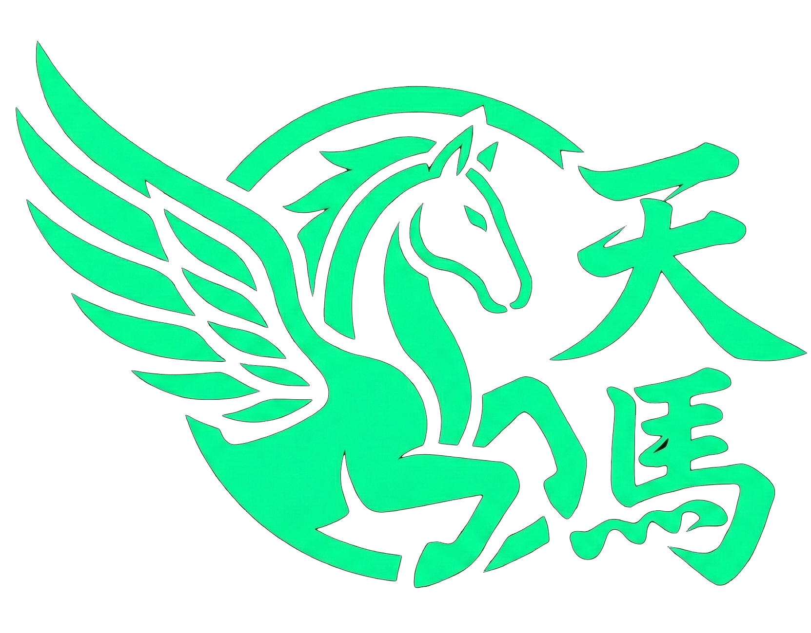

<p align="center">
  
</p>

<h1 align="center">🏇 TENMA - Horse Racing Game</h1>

<p align="center">
  <strong>A fully on-chain horse racing & staking game built on Solana</strong>
</p>

<p align="center">
  <a href="https://pump.fun/coin/GdhcpizTGFmooo8G87J46cbGkXQW6KxvMUfhTqApump">
    
  </a>
  <a href="https://x.com/i/communities/2007237901587710458">
    
  </a>
  <a href="https://solscan.io/account/2S398gEigP71GhLjryxZwL4xTJ5iEE8QH3q5Vmo4r6v8">
    
  </a>
</p>

---

## 📋 Deployment Information

| Detail | Value |
|--------|-------|
| **Program ID** | `2S398gEigP71GhLjryxZwL4xTJ5iEE8QH3q5Vmo4r6v8` |
| **Token Mint** | `GdhcpizTGFmooo8G87J46cbGkXQW6KxvMUfhTqApump` |
| **Network** | Solana Mainnet |
| **Deployment Tx** | [`4a5axexsCb82pbzm5m5xCoJEEY1VCrQ7QEyAETuqtyM8Xk55LunFLhToVWe5eu2hpcqkkhJS2VpQxayXsYDdU77Y`](https://solscan.io/tx/4a5axexsCb82pbzm5m5xCoJEEY1VCrQ7QEyAETuqtyM8Xk55LunFLhToVWe5eu2hpcqkkhJS2VpQxayXsYDdU77Y) |
| **Framework** | Anchor 0.31.0 |

### Verified Links
- 🔗 **Program**: [View on Solscan](https://solscan.io/account/2S398gEigP71GhLjryxZwL4xTJ5iEE8QH3q5Vmo4r6v8)
- 🪙 **Token**: [Buy on Pump.fun](https://pump.fun/coin/GdhcpizTGFmooo8G87J46cbGkXQW6KxvMUfhTqApump)
- 👥 **Community**: [Join on X](https://x.com/i/communities/2007237901587710458)

---

## 🎮 Game Overview

### 🐴 Horse Collection & Breeding
- Collect horses with different grades: **E**, **D**, **C**, **B**, **SS**
- Each horse has unique **speed** and **stamina** stats
- **Fuse** horses of the same grade for a chance to upgrade
- Higher grade horses earn more rewards per slot

### 🏠 Stable System
- **10 Stable Levels**: From Small Barn to Legendary Ranch
- Each upgrade increases racing slots and feed capacity
- Upgrade using $TENMA tokens

| Level | Name | Racing Slots | Feed Capacity |
|-------|------|--------------|---------------|
| 1 | Small Barn | 2 | 6 |
| 2 | Medium Barn | 4 | 12 |
| 3 | Large Barn | 7 | 20 |
| 4 | Ranch | 10 | 40 |
| 5 | Large Ranch | 13 | 70 |
| 6 | Training Facility | 16 | 110 |
| 7 | Professional Stable | 19 | 230 |
| 8 | Elite Stable | 22 | 420 |
| 9 | Championship Facility | 24 | 800 |
| 10 | Legendary Ranch | 25 | 2000 |

### 🏁 Racing & Rewards
- Enter horses into races to earn $TENMA tokens
- Rewards distributed based on total speed contribution
- Claim rewards anytime - no lockup period

### 🤝 Referral System
- Share your referral code with friends
- Earn **10%** of all token purchases made by your referrals
- Referral rewards paid automatically on-chain

---

## 🛠️ Tech Stack

| Component | Technology |
|-----------|------------|
| **Blockchain** | Solana |
| **Framework** | Anchor 0.31.0 |
| **Language** | Rust |
| **Token Standard** | SPL Token-2022 |

---

## 📁 Program Structure

```
programs/horsegame/src/
├── lib.rs           # Program entry point & instruction handlers
├── state.rs         # Account structures (GlobalState, Player, Horse)
├── instructions.rs  # Instruction logic
├── errors.rs        # Custom error definitions
├── constants.rs     # Game constants & configurations
└── helpers.rs       # Utility functions
```

---

## 🔧 Program Instructions

| Instruction | Description |
|-------------|-------------|
| `initialize` | Initialize global state (admin only) |
| `set_token_mint` | Set the token mint address (admin only) |
| `purchase_initial_stable` | Buy first stable with 3 starter horses |
| `enter_race` | Enter a horse into racing |
| `withdraw_from_race` | Remove horse from racing |
| `claim_rewards` | Claim accumulated $TENMA rewards |
| `upgrade_stable` | Upgrade stable to next level |
| `open_horse_pack_commit` | Start buying a horse pack (commit phase) |
| `settle_open_horse_pack` | Reveal horse pack (randomness phase) |
| `breed_horses_commit` | Start fusing horses (commit phase) |
| `breed_horses_settle` | Complete fusion (randomness phase) |

---

## 🏗️ Building

### Prerequisites
- Rust 1.75+
- Solana CLI 1.18+
- Anchor 0.31.0

### Build

```bash
# Install Anchor
cargo install --git https://github.com/coral-xyz/anchor --tag v0.31.0 anchor-cli

# Build the program
anchor build

# Get program keypair
solana-keygen pubkey target/deploy/horsegame-keypair.json
```

### Deploy

```bash
# Deploy to mainnet
anchor deploy --provider.cluster mainnet

# Or using Solana CLI
solana program deploy target/deploy/horsegame.so --program-id target/deploy/horsegame-keypair.json
```

---

## 🔐 Security

- ✅ Deployed on Solana Mainnet
- ✅ All game logic executed on-chain
- ✅ No admin keys required for gameplay
- ✅ Token-2022 standard for modern token features
- ✅ Commit-reveal scheme for fair randomness (using SlotHashes)
- ✅ Referral earnings capped and validated

---

## 📜 License

This project is open source and available under the [MIT License](LICENSE).

---

## 📞 Links

- 🪙 **Token**: [Pump.fun](https://pump.fun/coin/GdhcpizTGFmooo8G87J46cbGkXQW6KxvMUfhTqApump)
- 👥 **Community**: [X Community](https://x.com/i/communities/2007237901587710458)
- 🔗 **Program**: [Solscan](https://solscan.io/account/2S398gEigP71GhLjryxZwL4xTJ5iEE8QH3q5Vmo4r6v8)

---

<p align="center">
  Built with ❤️ on Solana
</p>
